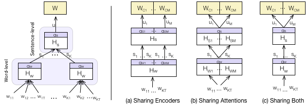
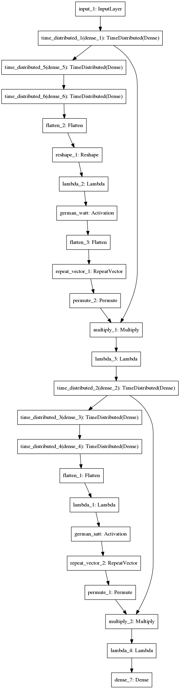
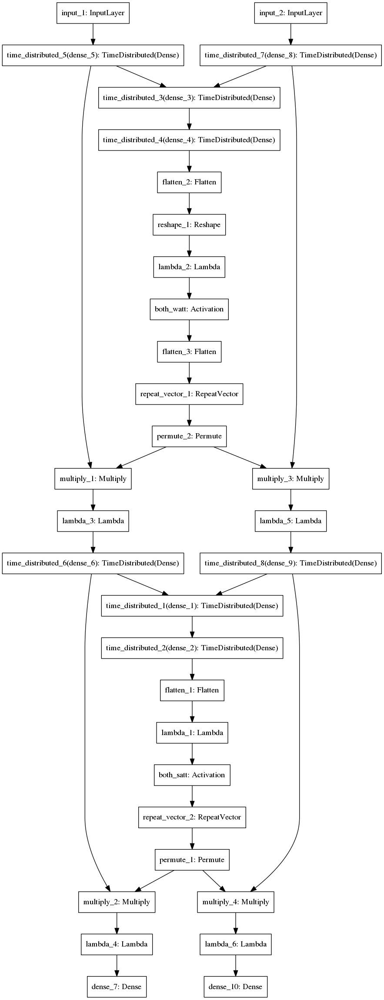
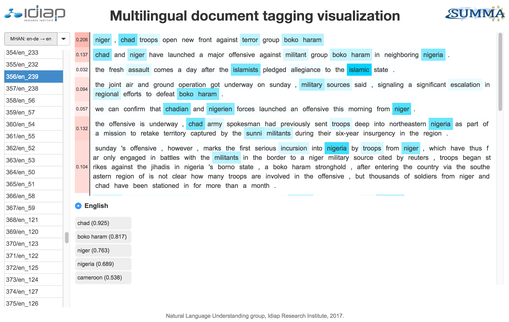

<b>mhan</b> —
This repository contains a Python implementation of Multilingual Hierarchical Attention Networks (MHANs) for document classification which was presented at IJCNLP 2017 [<a href="http://publications.idiap.ch/downloads/papers/2017/Pappas_IJCNLP_2017.pdf">1</a>].  These models are applicable when multilingual document  collections  are  considered and they improve over previously proposed monolingual Hierarchical Attention Networks (HANs) [<a href="http://www.aclweb.org/anthology/N16-1174">2</a>] which need to be trained separately  for  each language entailing linear parameter growth and lack of cross-language  transfer.  MHANs are able to overcome these issues by learning document structures,  with  shared  encoders  and/or shared  attention  mechanisms  across  languages,  using  multi-task  learning  and  an aligned semantic space as input.  
<p align="center">
<a href="http://publications.idiap.ch/downloads/papers/2017/Pappas_IJCNLP_2017.pdf"></a>
</p>
</p>

```
@inproceedings{Pappas_IJCNLP_2017,
  author    = {Pappas, Nikolaos  and  Popescu-Belis, Andrei},
  booktitle = {Multilingual Hierarchical Attention Networks for Document Classification},
  journal   = {8th International Joint Conference on Natural Language Processing},
  address   = {Tapei, Taiwan},  
  pages     = {1015--1025},
  year      = {2017},
  url       = {http://www.aclweb.org/anthology/I17-1102}
}
```

Dependencies
------------
The available code requires Python 2.7 programming language and pip package manager to run. 
For detailed instructions on how to install it along with a package manager please refer 
to the following links: http://www.python.org/getit/ and http://www.pip-installer.org/en/latest/.

Next, you should be able to install the following packages: <br />
```
$ pip install gzip, h5py, pickle, pydot-ng
$ pip install scipy, numpy, sklearn
$ pip install nltk==3.2
$ pip install Theano==0.8.2
$ pip install keras==1.2.2
```
For setting up your GPUs to work with Theano please refer to <a href="http://deeplearning.net/software/theano/install_ubuntu.html">here</a> and  <a href="http://deeplearning.net/software/theano/tutorial/using_gpu.html">here</a>. For example, our configuration of theano for running on GPUs with <a href="https://developer.nvidia.com/cuda-downloads">CUDA</a> and <a href="https://developer.nvidia.com/cudnn">cuDNN</a> was the following one: 
```
THEANO_FLAGS='cuda.root=<path>/CUDA-7.5, mode=FAST_RUN, dnn.enabled=True, device=gpu, lib.cnmem=0.9'
```

Dataset
-------------
The evaluation of the MHAN models was done on a large dataset collected from Deutsche Welle, Germany’s public international broadcaster (dw.com). This dataset contains nearly 600,000 documents in 8 languages which are annotated by journalists with general and specific topic categories [<a href="http://publications.idiap.ch/downloads/papers/2017/Pappas_IJCNLP_2017.pdf">1</a>] (see Table 2). Respecting <a hre="http://www.dw.com/en/is-the-re-posting-of-articles-from-dwcom-permitted/a-3264678" target="_blank">Deutsche Welle's policy</a> we provide only the URLs of the news articles and not their entire content. To facilitate the download of the data and their pre-processing according to [<a href="http://publications.idiap.ch/downloads/papers/2017/Pappas_IJCNLP_2017.pdf">1</a>] we provide a crawling and pre-processing script file written in Python with name: fetch_data.py. The provided script has the following usage.

```
$ python fetch_data.py --h
usage: fetch_data.py [-h] [--lang LANG] [--urlpath URLPATH]
                     [--outpath OUTPATH] [--embpath EMBPATH] [--ltype LTYPE]

Deutsche-Welle data download toolkit.

optional arguments:
  -h, --help         show this help message and exit
  --lang LANG        Language of the news articles.
  --urlpath URLPATH  Path where the URLs are stored.
  --outpath OUTPATH  Path where the results should be stored.
  --embpath EMBPATH  Path of the word vectors in pickle format for each
                     language (e.g. english.pkl, etc).
  --ltype LTYPE      Type of the categories: specific (kw) or general (rou).
``` 
For example, to download and pre-process the data for the general German categories used in [<a href="http://publications.idiap.ch/downloads/papers/2017/Pappas_IJCNLP_2017.pdf">1</a>] the command should be the one that follows. The corresponding command should be run for all the combinations of languages, namely English, German, Spanish, Portuguese, Ukrainian, Russian, Arabic and Persian, and type of target categories, namely general and specific.  
```
$ python fetch_data.py --lang german --urlpath data_urls/dw_general --outpath data/dw_general --ltype rou
[*] Loading german word vectors...
        word_vectors/german.pkl                                    OK
[*] Fetching dev data...
      german (22/13264)
...
[*] Storing dev data...
[*] Storing test data...
[*] Storing training data...
[-] Finished.
```
**Note**: Given that some of the URLs in the provided collection under data_urls/ may have been removed or modified by Deutsche Welle since our initial crawl, we also provide upon email request our own pre-processed version of the data which was used in [<a href="http://publications.idiap.ch/downloads/papers/2017/Pappas_IJCNLP_2017.pdf">1</a>] (see Table 2).  


Usage
------------
```
$ python run.py --help 
usage: run.py [-h] [--wdim WDIM] [--swpad SWPAD] [--spad SPAD] [--sdim SDIM]
              [--ddim DDIM] [--ep EP] [--ep_size EP_SIZE] [--bs BS]
              [--enc ENC] [--act ACT] [--gruact GRUACT] [--share SHARE]
              [--t T] [--seed SEED] [--wordemb_path WORDEMB_PATH]
              [--args_file ARGS_FILE] [--store_file STORE_FILE]
              [--languages LANGUAGES [LANGUAGES ...]] [--data_path DATA_PATH]
              [--path PATH] [--target TARGET] [--source SOURCE] [--train]
              [--test] [--store_test]

Multilingual Hierachical Attention Networks toolkit.

optional arguments:
  -h, --help            show this help message and exit
  --wdim WDIM           Number of dimensions of the word embeddings.
  --swpad SWPAD         Maximum number of words in a sentence.
  --spad SPAD           Maximum number of sentences in a document.
  --sdim SDIM           Number of hidden dimensions of the word-level encoder.
  --ddim DDIM           Number of hidden dimensions of the sentence-level
                        encoder.
  --ep EP               Maximum number of epochs for training.
  --ep_size EP_SIZE     Maximum number of samples per epoch during training.
  --bs BS               Size of batch to be used for training.
  --enc ENC             Type of encoder and pooling layer to be used at each
                        level of the hierarchical model, namely dense, gru or
                        bigru (transformation + average pooling) or attdense,
                        attgru, attbigru (transformation + attention
                        mechanism).
  --act ACT             Activation to be used for the Dense layers.
  --gruact GRUACT       Activation to be used for the GRU/biGRU layers.
  --share SHARE         Component to share in the multilingual model: encoders
                        (enc), attention (att) or both (both).
  --t T                 Decision threshold to be used for validation or
                        testing.
  --seed SEED           Random seed number.
  --args_file ARGS_FILE
                        Name of the file in the experiment folder where the
                        settings of the model are stored.
  --wordemb_path WORDEMB_PATH
                        <Required:train|test|store_test> Path of the word
                        vectors in pickle format for each language (e.g.
                        english.pkl, etc).
  --languages LANGUAGES [LANGUAGES ...]
                        <Required:train> Languages to be used for multilingual
                        training.
  --data_path DATA_PATH
                        <Required:train|test|store_test> Path of the train/,
                        dev/ and test/ folders which contain data in json
                        format for each language.
  --path PATH           <Required:train> Path of the experiment in which the
                        model parameters and validation scores are stored
                        after each epoch.
  --target TARGET       <Required:test> Language in which the testing should
                        be performed.
  --source SOURCE       <Optional:test> Language in which model should be
                        loaded from. Useful only for cross-lingual tagging
                        (user with --store_test option).
  --store_file STORE_FILE
                        <Optional:store_test> Name of the file in the
                        experiment folder where the predictions and attention
                        scores of the model are stored.
  --max_num MAX_NUM     <Optional:store_test> Maximum number of test examples
                        to consider.
  --train               Train the model from scratch.
  --test                Test the model.
  --store_test          Store the predictions and attention scores of the
                        model on the test set.
------------------------------------------------------------
```
Usage: Training
-------------
To train a model we have to specify the --train argument in the run.py file. For each specified language, the script will automatically load the training and validation sets stored under the specified data folder and train the model on them. At each epoch the script will store a snapshot of the model along with its validation scores (precision, recall and F1-score) under the specified folder for all the languages involved in the training e.g. under exp/<language_1>/, exp/<language_2>/. In case the script detects already stored models for multiple epochs in the specified folder, it will continue training from the model stored at the last epoch. The examples below were run on GPU with Keras==2.0.8, Theano==0.9.0, numpy==1.13.3, CUDA v8.0.44 and cuDNN 5110.
### Monolingual models 
For instance to train a mononolingual HAN with DENSE encoders on general German categories we execute the following command.
```
$ python run.py --train --languages german --wordemb_path word_vectors/ --data_path=data/dw_general\
  --path exp/bi-gen/mono/han-att --wdim 40 --swpad 30 --spad 30 --sdim 100 --ddim 100 --ep 10 --bs 16\ 
  --enc attdense --act relu
[*] Loading german word vectors...
        word_vectors/german.pkl                                    OK
        /idiap/temp/npappas/dataset/dw_general/train/german.json   OK
        /idiap/temp/npappas/dataset/dw_general/dev/german.json     OK
        X_train (80%): 106181
        X_val (10%): 13264
        |V|: 370395, |Y|: 367
[*] Training model...
[*] No stored model to resume from.

Epoch 1/10
24992/25000    [=============================.] - 80s - loss: 0.0306 - p: 0.2616 - r: 0.3055 - f1: 0.2629
[*] Validating on german...
        **val p: 0.28269 - r: 0.33068 - f: 0.30481 
...
Epoch 10/10
24992/25000    [=============================.] - 79s - loss: 0.0130 - p: 0.4658 - r: 0.5633 - f1: 0.5042
[*] Validating on german...
        **val p: 0.53368 - r: 0.64920 - f: 0.58580 
[-] Finished.
...
```
### Multilingual models 
For instance to train a multilingual HAN with DENSE encoders and shared attention (MHAN-Att) on general English and German categories we execute the following command.
```
$ python run.py --train --languages english german --wordemb_path word_vectors/ --data_path=data/dw_general\
--path exp/bi-gen/multi/en-de/mhan-att --wdim 40 --swpad 30 --spad 30 --sdim 100 --ddim 100 --ep 10 --bs 16\
--enc attdense --act relu --share att
[*] Loading english word vectors...
	word_vectors/english.pkl                                   OK
	data/dw_general/train/english.json                         OK
	data/dw_general/dev/english.json                           OK
	X_train (80%): 90266
	X_val (10%): 11275
	|V|: 172938, |Y|: 327
[*] Loading german word vectors...
        word_vectors/german.pkl                                    OK
        /idiap/temp/npappas/dataset/dw_general/train/german.json   OK
        /idiap/temp/npappas/dataset/dw_general/dev/german.json     OK
        X_train (80%): 106181
        X_val (10%): 13264
        |V|: 370395, |Y|: 367
[*] Training model...
[*] No stored model to resume from.

Epoch 1/10
24992/25000    [=============================.] - 139s - loss: 0.0574 - p: 0.2286 - r: 0.2970 - f1: 0.2400
[*] Validating on english...
        **val p: 0.28135 - r: 0.21389 - f: 0.24303 

[*] Validating on german...
        **val p: 0.24772 - r: 0.16428 - f: 0.19755 
...
Epoch 10/10
24992/25000    [=============================.] - 125s - loss: 0.0244 - p: 0.4543 - r: 0.5692 - f1: 0.4998
[*] Validating on english...
        **val p: 0.58266 - r: 0.73379 - f: 0.64955 

[*] Validating on german...
        **val p: 0.52159 - r: 0.68343 - f: 0.59164 
[-] Finished.
```

Usage: Testing
-------------
To train a model we have to specify the --test argument in the run.py file and simply point to the directory of the model that we would like to evaluate and the language on which we would like to evaluate using the --target argument. The script will select the model with the best validation score in the specified directory and test it on the corresponding test set. When using the testing function, the architecture of the model is also plotted and stored in the specified directory (see below).
### Monolingual models 
Using the previous example, we can test the above mononolingual HAN with DENSE encoders, which was trained on general German categories, on the German test set as follows. 
```
$ python run.py --test --path exp/bi-gen/mono/han-att --target german --t 0.40
[*] Loading german word vectors...
        word_vectors/german.pkl                                    OK
        /idiap/temp/npappas/dataset/dw_general/test/german.json    OK
        X_test (10%): 13265
        |V|: 370395, |Y|: 367
[*] Loading best model (e=9, f1=0.586)...
        exp/bi-gen/mono/han-att/german/epoch_9-weights.h5          OK
[*] Testing model on german...
        threshold > 0.40
        **val p: 0.72407 - r: 0.49884 - f: 0.59071 
[-] Finished.
```
### Multilingual models 
Using the previous example, we can evaluate the above multilingual HAN with DENSE encoders and shared attention (MHAN-Att), which was trained on general English and German categories, on the German test set as follows.
```
$ python  run.py --test --path exp/bi-gen/multi/en-de/mhan-att --target german --t 0.40
[*] Loading english word vectors...
        word_vectors/english.pkl                                   OK
        /idiap/temp/npappas/dataset/dw_general/test/english.json   OK
        X_test (10%): 11275
        |V|: 172938, |Y|: 327
[*] Loading german word vectors...
        word_vectors/german.pkl                                    OK
        /idiap/temp/npappas/dataset/dw_general/test/german.json    OK
        X_test (10%): 13265
        |V|: 370395, |Y|: 367
[*] Loading best model (e=8, f1=0.596)...
        exp/bi-gen/multi/en-de/mhan-att/german/epoch_8-weights.h5  OK
[*] Testing model on german...
        threshold > 0.40
        **val p: 0.73441 - r: 0.51939 - f: 0.60846 
[-] Finished.
```
<table>
<tr>
	<td style="vertical-align:top;width:40%;text-align:center"><center><b>German HAN with Dense encoders</b></center></td>
	<td style="vertical-align:top;width:60%;text-align:center"><center><b>English-German MHAN with Dense encoders</b></center></td>
</tr>
</table>


Usage: Storing test predictions and attention scores
-------------
To store the predictions and attention scores of a model on a given set we have to specify the --store_test argument in the run.py file and simply point to the directory of the model that we would like to use and the language on which we would like to evaluate using the --target argument. The script will select the model with the best validation score in the specified directory, make the predictions on the corresponding test set and store the results in a JSON file defined by --store_file argument. 

### Monolingual prediction
We can store the predictions and the attention scores of the above mononolingual HAN on the German test set as follows. 
```
$ python run.py --store_test --max_num 500 --store_file mono-de_german.json --path exp/bi-gen/mono/han-att\ 
  --target german
```
### Multilingual prediction
Similarly, we can store them for the above multilingual HAN on the German test set as follows.
```
$ python run.py --store_test --max_num 500 --store_file multi-en-de_german.json --path exp/bi-gen/multi/en-\
  sp/mhan-att --target german
```
### Cross-lingual prediction
In case we would like to make cross-lingual predictions, in addition to the --target argument, we have to set the --languages argument in case of monolingual models (as below) and the --source argument which specifies the model to be used. For multilingual models we simply have to set the --source and --target arguments. 
```
$ python run.py --store_test --languages english german --max_num 500 --store_file mono-en_german.json\
--path exp/bi-gen/mono/han-att --source german --target english
```

Pre-trained word embeddings
-------------
The proposed models can function with any type of word embeddings, however we highly recommend to use an aligned space across languages for input which  significantly improves their performance. The provided word embeddings per language under word_vectors/ are 40-dimensional and they have been aligned across languages with multilingual-CCA on the Leipzig Corpora Collection by the authors of [<a href="https://arxiv.org/pdf/1602.01925.pdf">3</a>], so, if you use them please make sure you cite [<a href="https://arxiv.org/pdf/1602.01925.pdf">3</a>].  To obtain word vectors for more languages or of higher dimensionality (e.g. 500-d) or trained with another method, please check the data provided by the authors of [<a href="https://arxiv.org/pdf/1602.01925.pdf">3</a>].  For example, here are the links for the 40-d and 500-d embeddings in 59 languages: 
* 40-dimensional word vectors: <a href="http://wordvectors.org/trained-vecs/multilingual/fifty_nine.table5.multiCCA.size_40.normalized.gz">multiCCA (size=40)</a>
* 500-dimensional word vectors: <a href="http://wordvectors.org/trained-vecs/multilingual/fifty_nine.table5.multiCCA.size_512+w_5+it_10.normalized.gz">multiCCA (size=512)</a>

Note that when using other embeddings than the provided ones you should store them in a gzip compressed pickle file, e.g.  \<language\>.pkl.gz, for each language separately. The pickle file should have the following format:
```bash
$ python
>>> import pickle
>>> import gzip
>>> path = 'word_vectors/english.pkl'
>>> embeddings = pickle.load(gzip.open(path+'.gz'))
>>> print 'vocab: %d' % len(embeddings[0])
vocab: 172938
>>> embeddings[0][:10]
[u'</s>', u'the', u',', u'.', u'of', u'to', u'and', u'in', u'a', u'that']
>>> print 'vectors: %d' % len(embeddings[1])
vectors: 172938
>>> print 'vec dims: %d' % len(embeddings[1][0])
vector dims: 40
>>> embeddings[1][0]
array([ 0.22220001,  0.2454,  ... -0.0125,  0.0283], dtype=float32)
```

Pre-trained hierarchical attention models
-------------
Apart from the code, we also provide the configurations of the best-performing MHAN models from the full-resource experiments in [<a href="http://publications.idiap.ch/downloads/papers/2017/Pappas_IJCNLP_2017.pdf">1</a>] (Tables 1 and 2): 

1. **bi-gen/**: Multilingual models with DENSE encoders on general categories (Table 1, upper part).
2. **bi-spe/**: Multilingual models with DENSE encoders on specific categories (Table 1, lower part). 
3. **enc-gen/**: Multilingual models with varying encoders (DENSE, GRU, biGRU) on general categories (Table 2)

One can apply all the above functionalities using the pre-trained models (--train, --test, --store_test). 

### Testing
The command below evaluates the English-German MHAN model with DENSE encoders on the English test set. The resulting F1-score should match exactly the one in the corresponding column of Table 2 in [<a href="http://publications.idiap.ch/downloads/papers/2017/Pappas_IJCNLP_2017.pdf">1</a>]. 

```
$ python run.py --test --path pretrained/bi-spe/en-de/mhan-att --target english
[*] Loading english word vectors...
word_vectors/english.pkl.gz
	word_vectors/english.pkl                                   OK
	data/dw_specific/test/english.json                         OK
	X_test (10%): 10551
	|V|: 172938, |Y|: 1058
[*] Loading russian word vectors...
word_vectors/russian.pkl.gz
	word_vectors/russian.pkl                                   OK
	data/dw_specific/test/russian.json                         OK
	X_test (10%): 8105
	|V|: 135022, |Y|: 814
[*] Loading best model (e=198, f1=0.473)...
	pretrained/bi-spe/en-ru/mhan-att/english/epoch_198-weights.h5OK
[*] Testing model on english...
	threshold >= 0.20
	**val p: 0.46508 - r: 0.46390 - f: 0.46449
[-] Finished.
``` 

### Re-training
To train the model from scratch using the same configuration (args.json) and initial weights as in [1], one has to simply remove the optimal pre-trained model files from the specified path folder as follows:

```
$ rm  pretrained/bi-spe/multi/en-de/mhan-att/english/*_[1-9]*-* 
$ python run.py --path pretrained/bi-spe/multi/en-de/mhan-att --train
``` 
For instance, when running the above command with Keras==2.0.8, Theano==0.9.0, numpy==1.13.3, CUDA v8.0.44 and cuDNN 5110 it leads to an  f-score of 0.46339 on the English test set. For those who are interested, we also provide upon request the configurations and initial weights of all the other models (including baselines). 

Visualization tool
-------------
 
The hierarchical attention networks have the nice property of attending to the relevant parts of the input which assist them to make accurate predictions. In order to be able to inspect the attention score distributions and the label predictions of a given model we designed a web-based interface which visualizes both of them. The visualization tool takes as input the json files as produced by the --store_test option above, so it is easy to use it in combination with the mhan library. For instance, below we can observe the attention scores that were assigned at the word-level and sentence-level for a chosen document from the test set by a multilingual HAN with shared attention trained on English and German general categories. To view more examples please check the online <a href="http://nik0spapp.github.io/demos/mhan/">mhan demo</a>.

<p align="center">
<a href="http://nik0spapp.github.io/demos/mhan/"></a>
</p> 

### Loading the files obtained with --store_test argument
To display the stored results of a particular model you have to follow the steps below:
1. Use the --store_test option to store the predictions and attention scores of a model on the general or specific categories of a given language. Note that the stored file should have the following naming format: \<modelname\>_\<lang\>.json e.g. monokw-de_german.json, monokw-de_engish.json
2. Move the above files under the visualization/ folder.
3. Edit visualization/lib/explore.js to add the name and description of the visualization to fnames hash, the keys of which should have the <modelname> of the model to be loaded (as in 1st step above), as follows:
```bash
var fnames = { 'multikw-en': 'MHAN: en-de → en',
    	       'multikw-de': 'MHAN: en-de → de',
               'monokw-de': 'HAN: en,de → en' };
```
4. Open explore.html in a browser (recommended one is Firefox).

Note that when the visualization tool detects multiple json files with the same experiment name as above it assumes that they have been tested on the same test set for the target language and both of them are going to be visualized in the interface; this is mainly useful for displaying cross-lingual predictions. For instance, in the above example (step 3) the predicted tags will be displayed for both the English and the German models (along with their attention scores).


References
------------
* [1] Nikolaos Pappas, Andrei Popescu-Belis, <a href="http://publications.idiap.ch/downloads/papers/2017/Pappas_IJCNLP_2017.pdf">Multilingual Hierarchical Attention Networks for Document Classification</a>, 8th International Joint Conference on Natural Language Processing , Tapei, Taiwan, 2017
* [2] Zichao Yang, Diyi Yang, Chris Dyer, Xiaodong He, Alex Smola, Eduard Hovy, <a href="http://www.aclweb.org/anthology/N16-1174">Hierarchical Attention Networks for Document Classification</a>, Proceedings of the 2016 Conference of the North American Chapter of the Association for Computational Linguistics: Human Language Technologies, San Diego, California, 2016
* [3] Waleed Ammar, George Mulcaire, Yulia Tsvetkov, Guillaume Lample, Chris Dyer, Noah A. Smith, <a href="https://arxiv.org/pdf/1602.01925.pdf"> Massively Multilingual Word Embeddings</a>, CoRR abs/1602.01925, 2016

Acknowledgements
------------
 We are grateful for funding to the European Union's Horizon 2020 program through the SUMMA project (Research and Innovation Action, grant agreement n. 688139): Scalable Understanding of Multilingual Media, see <a href="http://www.summa-project.eu/">http://www.summa-project.eu/</a>. 

## Contact:
npappas@idiap.ch

